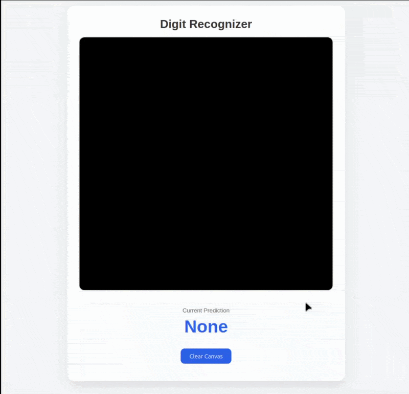

<h1>Neural Network From Scratch (NumPy Only)</h1>

A full-stack handwritten digit recognition application built from the ground up using Python, NumPy, Flask, and JavaScript. The neural network, including forward propagation, backpropagation, and gradient descent, was implemented entirely from scratch without relying on machine learning frameworks such as TensorFlow, PyTorch, or Keras.

The project includes an interactive web application where users can draw handwritten digits directly in their browser and receive real-time predictions from the trained neural network.

<h3>Why build a neural network from scratch?</h3>

Modern machine learning libraries abstract away much of the underlying mathematics. This project was created to develop a deeper understanding of how neural networks operate internally by implementing every stage of training and inference manually.

<h3>Features</h3>

<ul>
  <li>Neural network implemented entirely with NumPy</li>
  <li>Configurable network architecture</li>
  <li>Model serialization for saving and loading trained weights</li>
  <li>Trained on the MNIST handwritten digit dataset</li>
  <li>Flask REST API for model inference</li>
  <li>Interactive browser-based drawing canvas</li>
  <li>Real-time handwritten digit recognition</li>
  <li>Publicly deployed web application on Render</li>
</ul>

<h3>Live Application:</h3>
<a href="https://neuralnetworknumpyonly.onrender.com">neuralnetworknumpyonly.onrender.com</a>


<p align="center">
  
</p>

## Project Architecture

```text
            Browser
      (HTML, CSS, JavaScript)
               │
               │ POST /predict
               ▼
         Flask REST API
               │
      Image Preprocessing
               │
               ▼
         Neural Network
               │
               ▼
        Predicted Digit
               │
               ▼
    JSON Response → Browser
```
      
<h3>How It Works</h3>
1. Training

The network is trained using the MNIST handwritten digit dataset.

During training the model performs:

Forward propagation
Loss calculation
Backpropagation
Gradient descent weight updates

The learned parameters are then serialized so the model can be loaded without retraining.

2. Inference

When a user draws on the web interface:

The browser captures the drawing using an HTML5 canvas.
The image is sent to the Flask backend through a REST API.
The backend preprocesses the image into the 28×28 grayscale format expected by the model.
The trained neural network performs inference.
The predicted digit is returned as JSON and displayed in real time.
